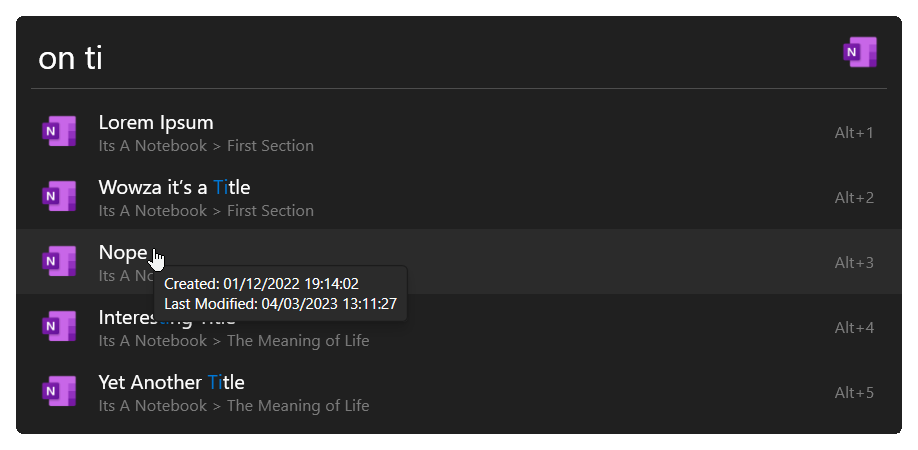
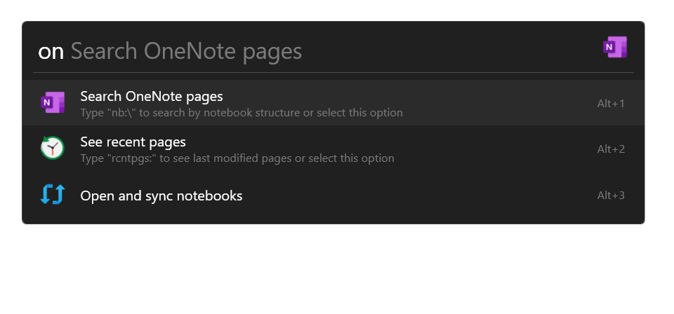

# OneNote for Flow Launcher

A OneNote plugin for the [Flow launcher](https://github.com/Flow-Launcher/Flow.Launcher), allowing for the ability to quickly access and create notes.

## Features and Usage

| Keyword                         | Name | Description   |
|---------------------------------|------|---------------|
| `` on {OneNote search query} `` | [Default Search](#default-search) | Search OneNote pages, searches page title and content |
| `` on nb:\ ``                   | [Notebook Explorer](#notebook-explorer)     | Navigate notebooks, sections and pages explorer style |
| `` on rcntpgs: ``               | [Recent Pages](#recent-pages) | View recently modified pages |

### Default Search

### Notebook Explorer

- Allows for creating notebooks at the default notebook location (set in OneNote) as well as sections and pages at the current path.
- Pressing <kbd>⏎ Enter</kbd> or <kbd>⇥ Tab</kbd> on a notebook or section will auto complete the query.
- Pressing <kbd>⇧ Shift</kbd> + <kbd>⏎ Enter</kbd> on a notebook or section allows you to open it directly in OneNote.
- Encrypted sections are hidden.

### Recent Pages

Add a number after `` rcntpgs: `` to display that number of recent pages. E.g. `` rcntpgs:10 `` will show the 10 most recently modified pages.

## Acknowledgements

Inspired by the OneNote plugin for [PowerToys](https://github.com/microsoft/PowerToys/tree/main/src/modules/launcher/Plugins/Microsoft.PowerToys.Run.Plugin.OneNote) (Its a port with extra features)

Icons from [Icons8](https://icons8.com)

Created with [ScipBe](https://github.com/scipbe/ScipBe-Common-Office) OneNote tools
