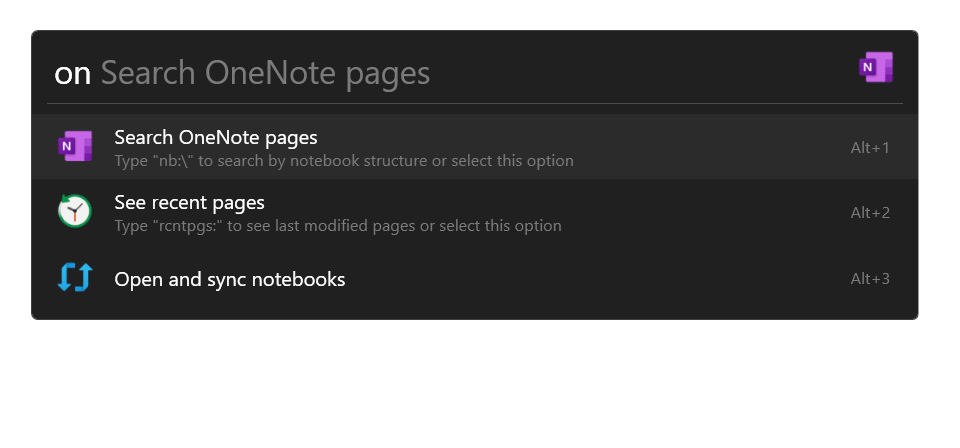
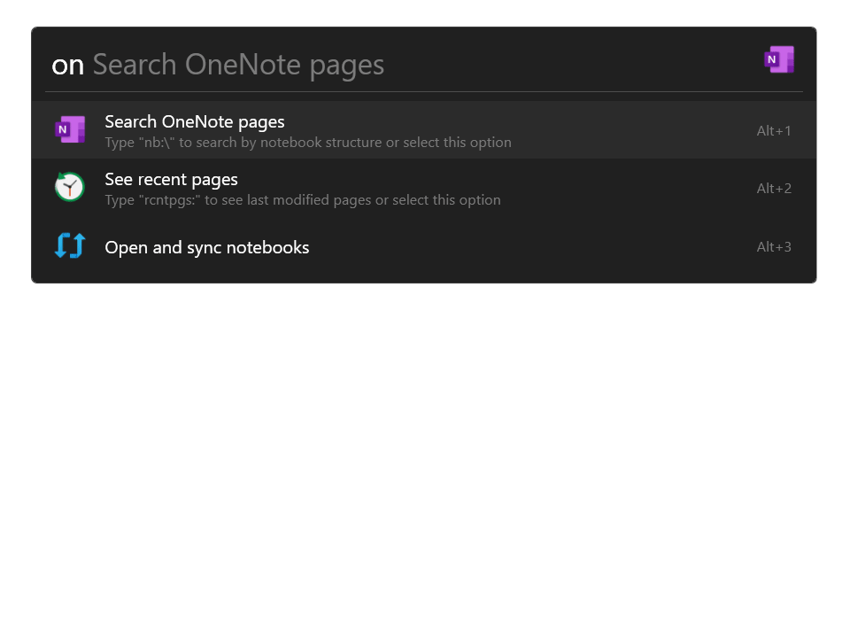
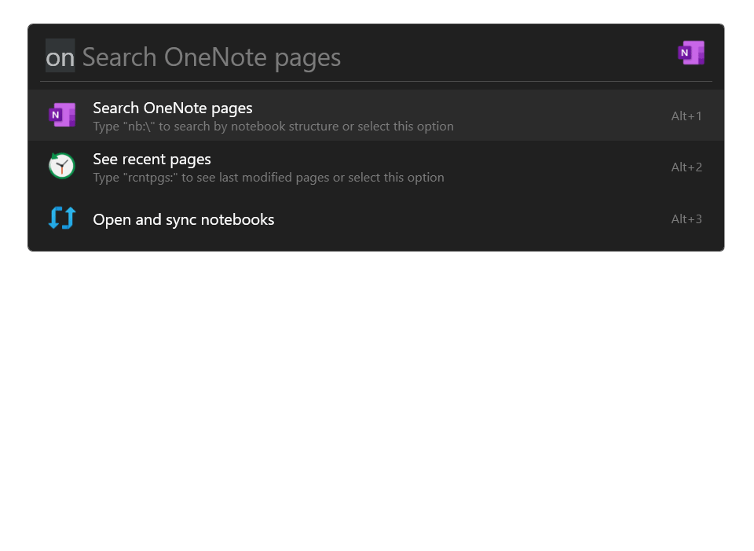

# OneNote for Flow Launcher

A OneNote plugin for the [Flow launcher](https://github.com/Flow-Launcher/Flow.Launcher).\
Allowing for searching your OneNote pages on your deivce as well as shortcuts for creating new ones.\

## Usage

| Keyword                         | Name | Description          |
|---------------------------------|------|---------------|
| `` on {onenote search query} `` | [Default Search](#default-search) | Search onenote pages, searches page title and content |
| `` on nb:\ ``                   | [Notebook Explorer](#notebook-explorer)     | Navigate notebooks, sections and pages explorer style |
| `` on rcntpgs: ``               | [Recent Pages](#recent-pages) | View recently modified pages |

### Default Search

### Notebook Explorer

When using `` nb:\ `` encrypted sections are hidden.\

### Recent Pages

Append a number after `` rcntpgs: `` to display that number of recent pages. E.g. `` rcntpgs:10 `` will show the last modified 10 pages.\

## Acknowledgements

Inpsired by the OneNote plugin for [Powertoy](https://github.com/microsoft/PowerToys/tree/main/src/modules/launcher/Plugins/Microsoft.PowerToys.Run.Plugin.OneNote) (Its a port with extra features)

Icons from [Icons8](https://icons8.com)

Created with [Scipe](https://github.com/scipbe/ScipBe-Common-Office) OneNote tools
