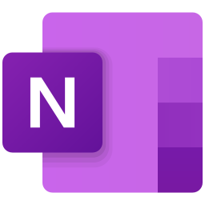

 <p align="center">
	<a href="https://flowlauncher.com">
		
	</a>
	<a href="https://www.microsoft.com/en-gb/microsoft-365/onenote/digital-note-taking-app">
		
	</a>
</p>
<h1 align="center">OneNote for Flow Launcher</h1>

A [OneNote](https://www.microsoft.com/en-gb/microsoft-365/onenote/digital-note-taking-app) plugin for the [Flow launcher](https://github.com/Flow-Launcher/Flow.Launcher), allowing for the ability to quickly access and create notes.

<!-- omit from toc -->
## Contents 
- [Installation](#installation)
- [Features](#features)
	- [Core Features](#core-features)
		- [Default Search](#default-search)
		- [Notebook Explorer](#notebook-explorer)
			- [Create New Items](#create-new-items)
		- [Recent Pages](#recent-pages)
	- [Extra](#extra)
		- [Scoped Search](#scoped-search)
		- [Title Search](#title-search)
- [Settings](#settings)
	- [Keywords](#keywords)
- [Acknowledgements](#acknowledgements)

## Installation
Using Flow Launcher type:
```
pm install OneNote
```
> [!IMPORTANT]
> Requires at least Flow Launcher version 1.16.

## Features
### Core Features 
#### Default Search
```
on {your search here}
```
The default mode allows you to search OneNote Pages.
Using `AND` or `OR`

 

#### Notebook Explorer

Transverse your OneNote Notebooks explorer style

##### Create New Items

#### Recent Pages

### Extra

#### Scoped Search

#### Title Search


## Settings

### Keywords

## Acknowledgements

- Made with [Odotocodot.OneNote.Linq](https://github.com/Odotocodot.OneNote.Linq) a library for exposing the OneNote API made by me :smiley:.
- Inspired by the OneNote plugin for [PowerToys](https://github.com/microsoft/PowerToys/tree/main/src/modules/launcher/Plugins/Microsoft.PowerToys.Run.Plugin.OneNote)
- Icons from [Icons8](https://icons8.com)