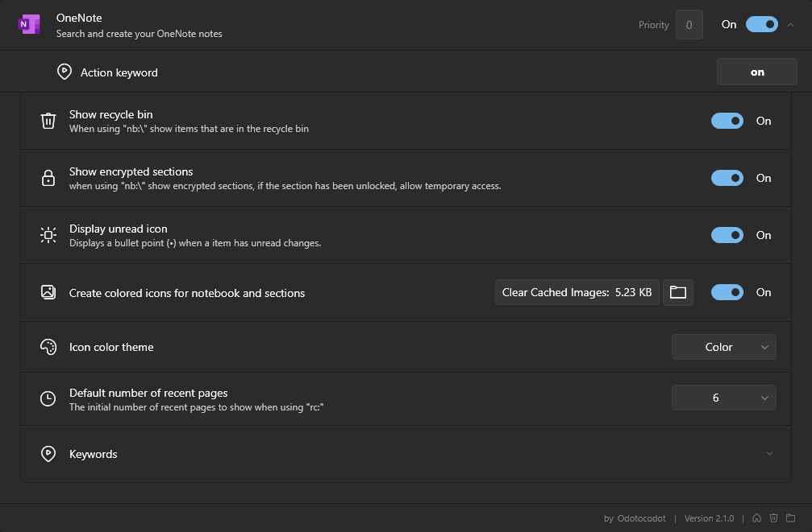

<p align="center">
  <a href="https://flowlauncher.com">
    
  </a>
  <a href="https://www.microsoft.com/en-gb/microsoft-365/onenote/digital-note-taking-app">
    
  </a>
</p>
<h1 align="center">OneNote for Flow Launcher</h1>

A [OneNote](https://www.microsoft.com/en-gb/microsoft-365/onenote/digital-note-taking-app) plugin for the [Flow launcher](https://github.com/Flow-Launcher/Flow.Launcher), allowing for the ability to quickly access and create notes.

<!-- omit from toc -->
## Contents

- [Installation](#installation)
- [Features](#features)
  - [At a Glance](#at-a-glance)
  - [Default Search](#default-search)
  - [Notebook Explorer](#notebook-explorer)
    - [Create New Items](#create-new-items)
  - [Recent Pages](#recent-pages)
  - [Scoped Search](#scoped-search)
  - [Title Search](#title-search)
- [Settings](#settings)
  - [Keywords](#keywords)
- [Changelog](#changelog)
- [Acknowledgements](#acknowledgements)

## Installation

Using Flow Launcher type:

```
pm install OneNote
```

> [!IMPORTANT]
> For [version 2.0+](#changelog) requires at Flow Launcher version 1.16+. For earlier versions see [releases](https://github.com/Odotocodot/Flow.Launcher.Plugin.OneNote/releases).

## Features

### At a Glance

| Keyword                    | Name                                    | Description                  |
| -------------------------- | --------------------------------------- | ---------------------------- |
| ` on {your search query} ` | [Default Search](#default-search)       | Search OneNote pages         |
| ` on nb:\ `                | [Notebook Explorer](#notebook-explorer) | Navigate notebooks hierarchy |
| ` on rcntpgs: `            | [Recent Pages](#recent-pages)           | View recently modified pages |

<!-- omit from toc -->
#### Modifiers

| Keyword | Name                            | Notes                                        |
| ------- | ------------------------------- | -------------------------------------------- |
| ` > `   | [Scoped Search](#scoped-search) | Search only within a specific hierarchy item |
| ` * `   | [Title Search](#title-search)   | Search only the title of hierarchy items     |

> [!NOTE]
> Hierarchy items are notebooks, section groups, sections and pages.

### Default Search

```
on {your search query}
```

This is allows you to search OneNote pages using the OneNote API which searches both the content in a page as well as the page title.

- Press <kbd>⏎ Enter</kbd> or left-click on a search result to open in OneNote.

> [!NOTE]
> You can include bitwise operators like `AND` or `OR` (they must be uppercase) in your search. E.g. `on hello there AND general kenobi`.


### Notebook Explorer

```
on nb:\
```

Traverse your OneNote notebooks explorer style.

- Press <kbd>⏎ Enter</kbd> or <kbd>⇥ Tab</kbd> or left-click on a result to auto complete the query.
- Press <kbd>⇧ Shift</kbd> + <kbd>⏎ Enter</kbd> or right-click on a result to open it directly in OneNote.


> [!NOTE]
> Supports all OneNote hierarchy items i.e. notebooks, section groups, sections and pages.

#### Create New Items

Whilst using the notebook explorer, if your search query does not match any names of the items in the results, the plugin will give you an option to create a new item.


> [!NOTE]
> Supports all OneNote hierarchy items i.e. notebooks, section groups, sections and pages.
>
### Recent Pages

```
on rcntpgs:
```

Displays your recently modified OneNote pages.

Add a number after `` rcntpgs: `` to display that number of recent pages. E.g. the full query ``on rcntpgs:10`` will show the 10 most recently modified pages.


### Scoped Search

```
on nb:\{hierarchy path}\>{your search query}
```

Scoped search is the same as [default search](#default-search) but restricted to search within a specific hierarchy item.

> [!IMPORTANT]
> Must be used with [notebook explorer](#notebook-explorer).


<details>
  <summary><h4>Example Queries<h4></summary>
  
  ```
  on nb:\A Notebook\A Section Group\>hello there
  ```

  Will use the OneNote API to search the hierarchy item `A Section Group` for `hello there`
  
</details>

### Title Search

```
on *{your search query}
```

Searches for hierarchy items based on their title alone. Unlike [scoped search](#scoped-search) and [default search](#default-search) which only return pages, title search can return all hierarchy item types.

> [!NOTE]
> Can be used in conjunction with [notebook explorer](#notebook-explorer).


<details>
  <summary><h4>Example Queries<h4></summary>
  
  ```
  on nb:\A Notebook\A Section Group\*hello there
  ```

  Will search for titles in the hierarchy item `A Section Group` that match or are similar to `hello there`
  
</details>

## Settings

The plugin has a number of settings such as the ability to hide the recycle bin or indicate which pages have unread changes.

<details>
  <summary>Screenshot of settings</summary>
  
</details>

### Keywords

All the keywords used can be changed according to user preference.

<details>
  <summary>Screenshot of keywords</summary>
  
</details>

## Changelog

See [here](Changelog.md) for the full list of changes.

## Acknowledgements

- Made with [Linq2OneNote](https://github.com/Odotocodot/Linq2OneNote) a library for exposing the OneNote API also made by me :smiley:
- Inspired by the OneNote plugin for [PowerToys](https://github.com/microsoft/PowerToys/tree/main/src/modules/launcher/Plugins/Microsoft.PowerToys.Run.Plugin.OneNote)
- Icons from [Icons8](https://icons8.com)
